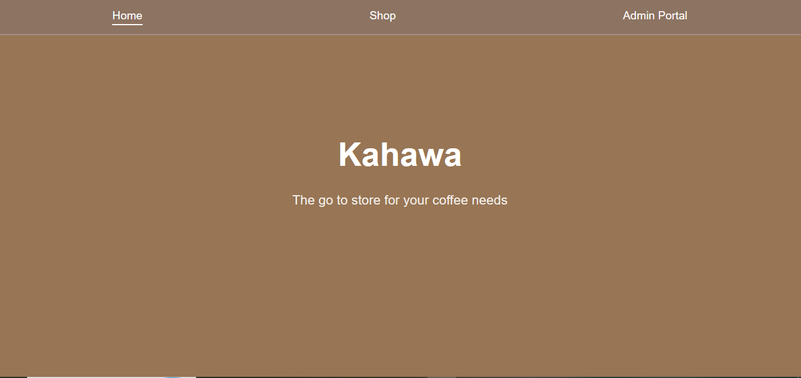

# Coffee R Us - E-Commerce & Admin Portal

A react-based coffee e-commerce application with an admin portal for managing products.

## Table of Contents

- [Overview](#overview)
- [Features](#features)
- [Live Demo](#live-demo)
- [Local Setup](#local-setup)
- [Technologies Used](#technologies-used)
- [Contact](#contact)
- [Roadmap](#roadmap)
- [License](#license)

## Overview

Coffee R Us is a modern e-commerce and admin portal built with React.

The application provides customers with an online coffee shopping experience while also providing an administrative interface for managing products.

## Features

- Browse available coffee products
- Navigate between different pages using React Router
- Add and manage products through the admin portal
- Update existing products
- Delete products
- Retrieve product data from a RESTful API
- Responsive user interface
- Dynamic rendering of product information
- Client-side routing without full page reloads

## Live Demo

Open the app using:

https://kahawamoto.netlify.app/

## Technologies Used

- React.js , React Router v7, Vite, CSS3
- JSON Server (RESTful API)
- JSON (`db.json`)

## Getting Started

Follow these instructions to get a copy of the project running on your local machine.

### Installation

1. Clone the repository:
   **bash**
   git clone git@github.com:Muchuku1/summative-lab.git

2. Navigate to the root directory:
   **bash**
   cd summative-lab

3. Use npm i to install the node modules

4. Use npm run server to run the server

5. On another terminal instance use npm run dev to run the react app

